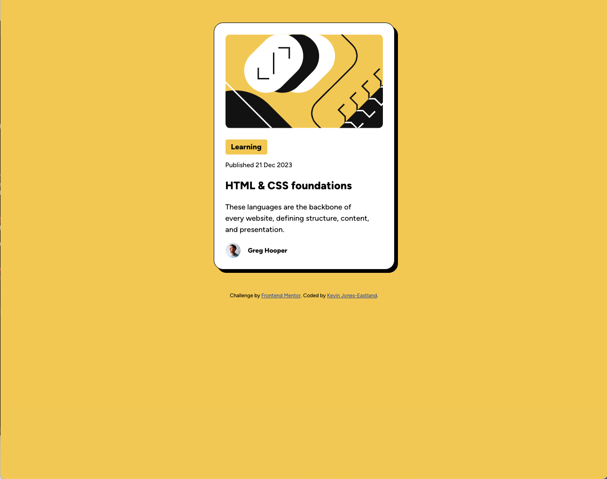

# Frontend Mentor - Blog preview card solution

This is a solution to the
[Blog preview card challenge on Frontend Mentor](https://www.frontendmentor.io/challenges/blog-preview-card-ckPaj01IcS).
Frontend Mentor challenges help you improve your coding skills by building
realistic projects.

## Table of contents

- [Overview](#overview)
  - [The challenge](#the-challenge)
  - [Screenshot](#screenshot)
  - [Links](#links)
- [My process](#my-process)
  - [Built with](#built-with)
  - [What I learned](#what-i-learned)
  - [Continued development](#continued-development)
  - [Useful resources](#useful-resources)
- [Author](#author)

## Overview

### The challenge

Users should be able to:

- See hover and focus states for all interactive elements on the page

### Screenshot

### Links

- Solution URL: [Github](https://github.com/kmje405/fem-blog-preview-card)
- Live Site URL: [Live Site](https://fem-blog-preview-card-kmje405.netlify.app/)

## My process

I started building this from the mobile breakpoint first, then simply adjusted
the card max-width on larger screens via a tablet and up breakpoint.

### Built with

- Semantic HTML5 markup
- CSS custom properties
- Flexbox
- Mobile-first workflow

### What I learned

I enjoyed this blog preview card as it's something that I often need to create
for client projects. This implementation was pure html & css with no
interactivity to speak of.

### Useful resources

- [fit-content](https://developer.mozilla.org/en-US/docs/Web/CSS/fit-content) -
  Had to look up this css property.

## Author

- Website - [Kevin Jones-Eastland](https://eastlandjones.com/)
- Frontend Mentor - [@kmje405](https://www.frontendmentor.io/profile/kmje405)
